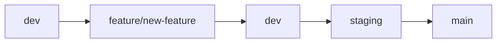
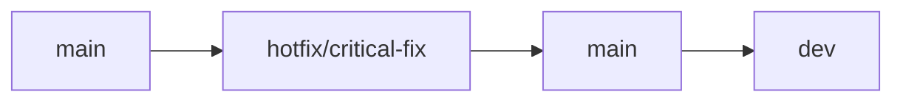

# 🌿 Git Branching Strategy - FitTrack

## 📋 Overview

This document outlines the branching strategy for the FitTrack fitness application. We follow a **Git Flow** inspired approach with simplified workflows optimized for our clean, modern React application.

## 🌳 Branch Structure

### **Main Branches**

| Branch | Purpose | Protection | Description |
|--------|---------|------------|-------------|
| `main` | Production | ✅ Protected | Live production code - always stable |
| `dev` | Development | ✅ Protected | Integration branch for all features |
| `staging` | Pre-production | ✅ Protected | Final testing before production |

### **Feature Branches**

| Branch Type | Naming Convention | Source | Target | Description |
|-------------|-------------------|--------|--------|-------------|
| **Feature** | `feature/description` | `dev` | `dev` | New features and enhancements |
| **Bugfix** | `bugfix/description` | `dev` | `dev` | Bug fixes and patches |
| **Hotfix** | `hotfix/description` | `main` | `main` + `dev` | Critical production fixes |
| **Release** | `release/version` | `dev` | `main` + `dev` | Release preparation |

## 🚀 Branch Lifecycle

### **Feature Development Flow**



1. **Create Feature Branch**: `git checkout -b feature/new-feature dev`
2. **Develop Feature**: Make commits with clear messages
3. **Push Feature Branch**: `git push origin feature/new-feature`
4. **Create Pull Request**: Merge `feature/new-feature` → `dev`
5. **Code Review**: Team reviews and approves
6. **Merge to Dev**: Feature integrated into development
7. **Deploy to Staging**: Test in staging environment
8. **Release to Production**: Merge `dev` → `main`

### **Hotfix Flow**



1. **Create Hotfix**: `git checkout -b hotfix/critical-fix main`
2. **Fix Issue**: Make minimal, focused changes
3. **Test Thoroughly**: Ensure fix works
4. **Merge to Main**: `hotfix/critical-fix` → `main`
5. **Merge to Dev**: `hotfix/critical-fix` → `dev`
6. **Tag Release**: Create version tag

## 📝 Branch Naming Conventions

### **Feature Branches**
```
feature/user-authentication
feature/goal-setting
feature/progress-tracking
feature/workout-plans
feature/nutrition-tracking
feature/social-features
feature/mobile-optimization
feature/analytics-dashboard
```

### **Bugfix Branches**
```
bugfix/login-validation
bugfix/goal-calculator
bugfix/mobile-layout
bugfix/data-persistence
```

### **Hotfix Branches**
```
hotfix/security-patch
hotfix/critical-crash
hotfix/data-loss
```

### **Release Branches**
```
release/v1.0.0
release/v1.1.0
release/v2.0.0
```

## 🔄 Workflow Commands

### **Starting New Feature**
```bash
# Ensure you're on dev and it's up to date
git checkout dev
git pull origin dev

# Create feature branch
git checkout -b feature/new-feature

# Start development
# ... make changes ...

# Commit changes
git add .
git commit -m "feat: add new feature description"

# Push feature branch
git push origin feature/new-feature
```

### **Updating Feature Branch**
```bash
# Update dev branch
git checkout dev
git pull origin dev

# Rebase feature branch on latest dev
git checkout feature/new-feature
git rebase dev

# Resolve conflicts if any
# ... resolve conflicts ...

# Force push (since rebase rewrites history)
git push origin feature/new-feature --force-with-lease
```

### **Merging Feature to Dev**
```bash
# Create Pull Request on GitHub
# ... create PR feature/new-feature → dev ...

# After approval, merge via GitHub
# Then clean up locally
git checkout dev
git pull origin dev
git branch -d feature/new-feature
git push origin --delete feature/new-feature
```

### **Creating Release**
```bash
# Create release branch from dev
git checkout dev
git pull origin dev
git checkout -b release/v1.0.0

# Make release-specific changes (version bump, etc.)
# ... make changes ...

# Merge to main
git checkout main
git merge release/v1.0.0

# Tag the release
git tag -a v1.0.0 -m "Release version 1.0.0"
git push origin v1.0.0

# Merge to dev
git checkout dev
git merge release/v1.0.0

# Clean up
git branch -d release/v1.0.0
git push origin --delete release/v1.0.0
```

## 📋 Commit Message Convention

We follow **Conventional Commits** specification:

```
<type>[optional scope]: <description>

[optional body]

[optional footer(s)]
```

### **Types**
- `feat`: New feature
- `fix`: Bug fix
- `docs`: Documentation changes
- `style`: Code style changes (formatting, etc.)
- `refactor`: Code refactoring
- `test`: Adding or updating tests
- `chore`: Maintenance tasks

### **Examples**
```bash
git commit -m "feat: add user authentication system"
git commit -m "fix: resolve login validation issue"
git commit -m "docs: update README with new features"
git commit -m "style: format code with prettier"
git commit -m "refactor: simplify goal calculation logic"
git commit -m "test: add unit tests for user service"
git commit -m "chore: update dependencies"
```

## 🛡️ Branch Protection Rules

### **Main Branch Protection**
- ✅ Require pull request reviews
- ✅ Require status checks to pass
- ✅ Require branches to be up to date
- ✅ Restrict pushes to matching branches
- ✅ Require linear history

### **Dev Branch Protection**
- ✅ Require pull request reviews
- ✅ Require status checks to pass
- ✅ Allow force pushes (for rebasing)
- ✅ Restrict deletions

### **Staging Branch Protection**
- ✅ Require pull request reviews
- ✅ Require status checks to pass
- ✅ Restrict pushes to matching branches

## 🎯 Feature Development Guidelines

### **Before Starting**
1. Check current `dev` branch status
2. Review existing issues and PRs
3. Create issue for new feature
4. Plan implementation approach

### **During Development**
1. Keep commits atomic and focused
2. Write clear commit messages
3. Test your changes thoroughly
4. Update documentation if needed
5. Keep feature branch up to date with `dev`

### **Before Merging**
1. Ensure all tests pass
2. Code review completed
3. Documentation updated
4. No merge conflicts
5. Feature tested in isolation

## 🚨 Emergency Procedures

### **Critical Bug in Production**
1. Create hotfix branch from `main`
2. Fix the issue with minimal changes
3. Test thoroughly
4. Merge to `main` and tag release
5. Merge to `dev` to keep in sync

### **Broken Dev Branch**
1. Identify the problematic commit
2. Create fix branch from last known good state
3. Apply fix and test
4. Merge fix to `dev`
5. Investigate root cause

## 📊 Branch Status Dashboard

| Branch | Status | Last Updated | Purpose |
|--------|--------|--------------|---------|
| `main` | ✅ Stable | Latest Release | Production |
| `dev` | 🔄 Active | Daily | Development Integration |
| `staging` | 🔄 Testing | Weekly | Pre-production Testing |

## 🔧 Tools and Automation

### **Git Hooks**
- Pre-commit: Lint and format code
- Pre-push: Run tests
- Commit-msg: Validate commit message format

### **CI/CD Pipeline**
- Automated testing on all branches
- Build verification
- Code quality checks
- Security scanning

### **Branch Management**
- Automatic cleanup of merged branches
- Branch naming validation
- Protection rule enforcement

---

**Last Updated**: August 2024  
**Version**: 1.0.0  
**Maintainer**: BUPE-NONDO
